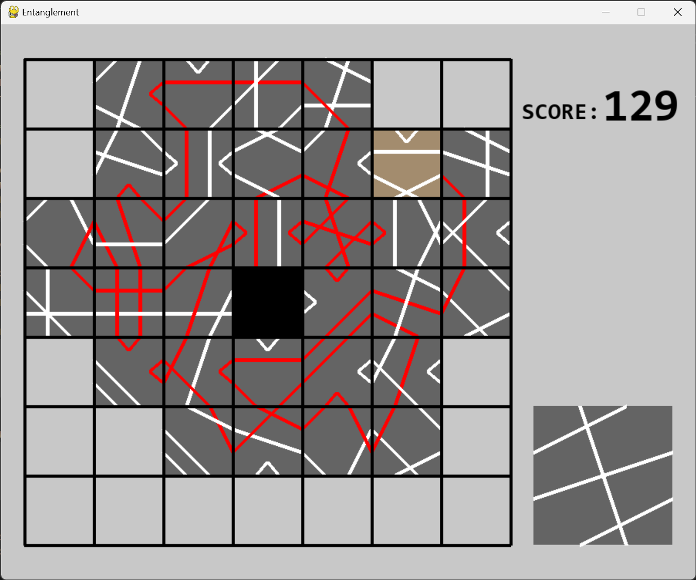

# Entanglement-in-Square

Square version of [Entanglement](https://entanglement.gopherwoodstudios.com/) with pygame

## Execute
`python3 game.py`

## Command
|action|key|
|----|---|
|put tile|`Enter`|
|rotate tile clockwise|`->`|
|rotate tile counterclockwise|`<-`|
|swap tile|`Space`|
|reset|`r`|

## TODO
- Improve design